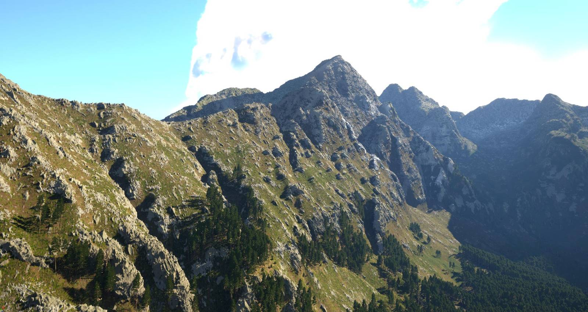

### What is Airland World?

Airland World is a vast planetary playground, a living virtual universe where players can create their own custom avatars and embark on limitless adventures. Whether you're exploring uncharted territories, building your dream home, surviving against the odds in the wilderness, or taking on thrilling missions, every experience is uniquely yours. In Airland World, your character grows, evolves, and becomes a part of an ever-changing story shaped by both the Airland team and an active community of creators.

But Airland World isn't just a game - it's a platform. Beyond playing, you'll discover a universe designed for creativity, where you can modify environments, craft new experiences, and even develop standalone games using the powerful Airland World Editor.

At the heart of it all lies the Airland Marketplace, a hub where players and creators come together to share, trade, and celebrate their creations. Players can discover a wide variety of content to enhance their gameplay. Whether you're looking for sleek new vehicles, stylish character skins, exciting adventures, or fully immersive experiences, you'll find them here. Some content may be available for free, while others may be premium offerings crafted by talented creators. Beyond in-world assets and missions, the Marketplace is also home to standalone games built using the Airland World Editor, offering entirely unique gaming experiences that go far beyond the default Airland World gameplay.

Airland World is also a social space. Players can gather in shared hubs, join factions, or participate in global events that shape the landscape of the game world. Whether you're teaming up with friends for a challenging expedition, organizing in-game festivals, or collaborating on community-driven projects, Airland World thrives on interaction and shared creativity.

More than just a virtual game, Airland World is an ever-expanding digital universe where every player, creator, and contributor leaves their mark. It’s not something you simply play—it’s something you live, build, and share.

