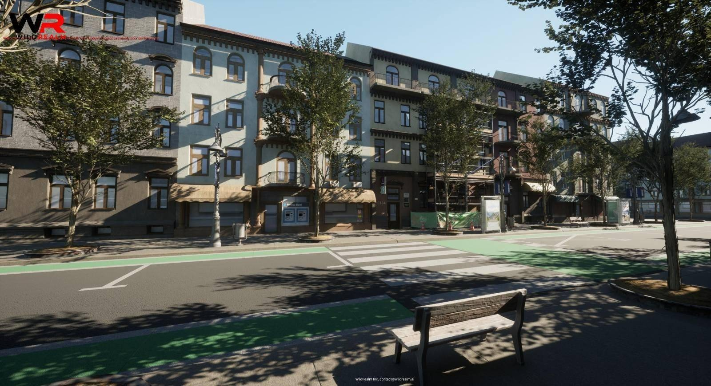

### Economy System

The Airland Economy System is designed to offer players and creators flexibility and reward participation. Your gaming experience can be enhanced by acquiring marketplace assets, either using real money or Airland Credits—the in-game currency of Airland World. Airland Credits can be purchased through convenient credit packages or earned by contributing to the ecosystem as a creator.

Whether you're designing a unique vehicle, scripting a thrilling quest, or building an expansive cityscape, your creations can earn you credits based on downloads and user engagement. These credits can then be reinvested into the Marketplace, enabling you to access premium assets, tools, or experiences.

Players can find an extensive variety of content in the Airland Marketplace, from vehicles, character skins, and mission packs to fully realized adventures and expansive regions. These offerings might be free or premium, depending on the creator's preference. Beyond assets and content, the Marketplace also hosts standalone games built using the Airland World Editor, allowing creators to share entire new gaming experiences.

This robust economy system not only ensures a thriving content ecosystem but also provides both casual and professional creators with a tangible way to benefit from their contributions. Whether you're enhancing your personal gaming experience or building your creative portfolio, the Airland Economy is designed to empower every participant in the ecosystem.

Your experience can be improved by buying marketplace assets either using real money or Airland Credits. Airland Credits is the in-game currency of Airland World. Credits can be purchased through convenient credit packages or earned by becoming a creator and contributing content to the Airland World ecosystem.

