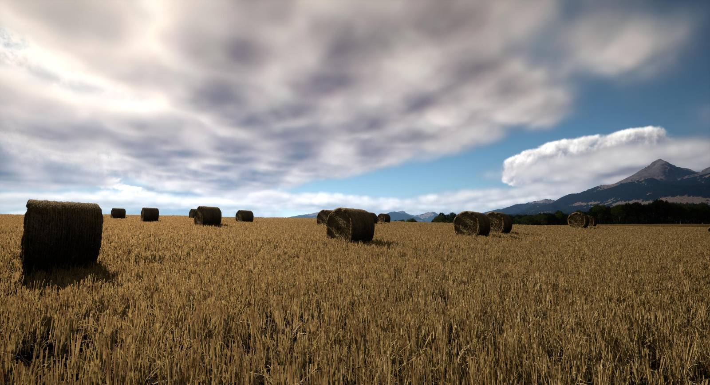

## Build, Share, and Grow

Airland World isn't just about playing—it's about contributing to something bigger. As a casual creator, you have the power to enhance the game world by adding new places, designing characters, crafting unique assets, scripting missions, or developing entire storylines. With the easy-to-learn LUAU scripting language and user-friendly tools provided by the Airland World Editor, even beginners can bring their visions to life.

Whether you’re designing a cozy mountain village, scripting an action-packed rescue mission, or adding a colorful new set of outfits for avatars, your creations have a place in Airland World. And it doesn’t stop there—your contributions can earn you game credits based on downloads and engagement, allowing you to further enhance your own gaming experience.

Additionally, casual creators can participate in collaborative projects, joining forces with other hobbyists to build massive cities, create epic questlines, or design unique in-game events. The tools provided make it easy to contribute on any scale, whether you're adding a small decorative asset or building an entire region.

Start small, dream big, and let your creativity become part of the fabric of Airland World. Every contribution counts, and every creator has the potential to leave a lasting legacy.
