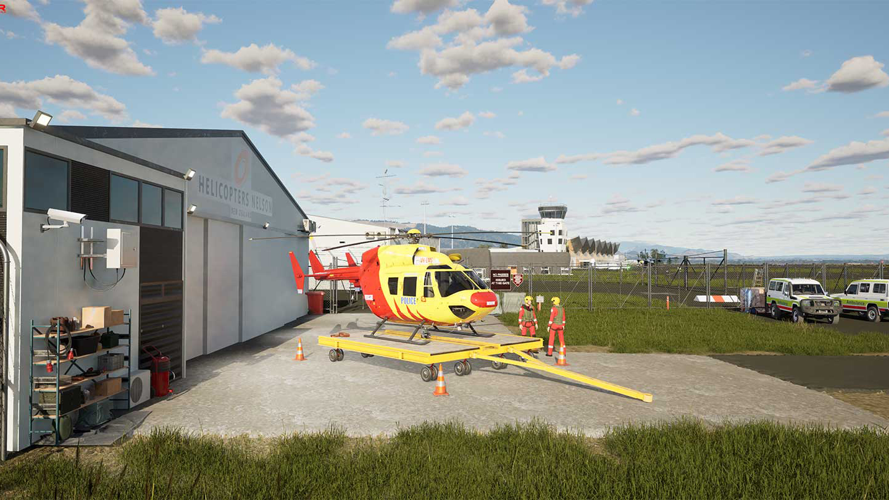

In addition to many games available on the **Airland Store**  Airland has a default gameplay mode called **Airland Life**. Here's what its all about...  

<!-- truncate -->

### A planetary roleplay game

Step into Airland Life, a vast planetary playground where imagination knows no limits and every corner of the world holds a new story waiting to be told. Here, you’ll create your custom character or avatar—your digital self—and guide them through a world filled with endless possibilities. Whether you dream of surviving against the odds in harsh wilderness, exploring breathtaking landscapes, climbing the ranks in a chosen career, or embarking on thrilling missions, every experience is yours to shape and make your own.

### Build a career

This world isn’t just about playing—it’s about living stories and becoming a part of something bigger. It’s a space where you can step into roles, create narratives, and embrace a sense of boundless playfulness. Build a home in a remote forest, pilot a rescue helicopter through stormy skies, run a bustling city filled with life and trade, or simply set off on an unpredictable journey of discovery across sprawling landscapes. Every path is yours to forge, and every choice you make will ripple through your world.

### Your characters come to life
Your characters aren't just static avatars—they grow, evolve, and leave their mark on the world around them. From customizing every detail of your appearance to developing unique skills and traits, your journey is as much about personal expression as it is about thrilling adventure. Whether you prefer to roleplay as a seasoned adventurer, a daring pilot, a skilled trader, or a fearless survivor, the world will react and adapt to your story.

### Unlimited adventures
The adventures and experiences you’ll encounter are crafted by both the dedicated Airland team and a passionate community of creators. Whether it’s an intricate questline filled with mystery, a breathtaking landscape designed for pure exploration, or an innovative game mode that redefines how you play, these experiences will be available on the Airland Marketplace. Here, players can discover, share, and enjoy content that brings fresh stories and challenges to life. With every new update, new adventures and endless opportunities await.

Whether you're here for heart-pounding adventures, peaceful escapes in scenic corners of the world, or meaningful connections with others who share your passions, this playground is yours to explore, shape, and call home.

Welcome to a world where every choice matters, every story counts, and every player has a place. The adventure begins with you.

