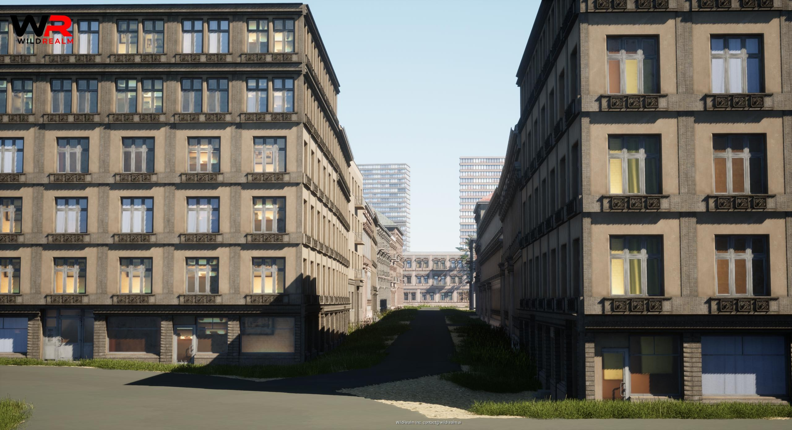

# For Hobby Creators: Shape, Build, and Share

### Create, Share, and Earn

If you’ve ever dreamed of shaping a virtual world, crafting your own adventures, or contributing to something bigger, this is your moment. Inspired by the incredible creativity seen in moddable games like GTA Roleplay (FiveM), Microsoft Flight Simulator, and Arma Reforger, this platform offers you the tools to bring your vision to life without the steep learning curve of traditional game engines.

<!-- truncate -->

You don’t need to be a professional developer—just passion, creativity, and curiosity are enough to get started. Use pre-existing templates to kickstart your dream game, or join community-wide projects aimed at enhancing and expanding the world. With the easy-to-learn LUAU scripting language, even beginners can create interactive experiences, unique mechanics, and dynamic gameplay loops.

As a hobby creator, you have two exciting paths ahead of you. You can build your own standalone game, crafting entirely new worlds and adventures, or you can contribute directly to Airland Life. Create additional places, design immersive assets, introduce new characters, craft exciting missions, or weave rich storylines into the ever-evolving tapestry of Airland Life. Whether you're adding a new bustling city, an isolated survival outpost, or a thrilling questline, your contributions will enhance the experience for thousands of players.

But creation here isn’t just about fun—it’s also rewarding. As a hobby creator, you’ll earn game credits based on the number of downloads, player engagement, and the popularity of your content. These credits can then be used to enhance your gaming experience, unlocking new tools, assets, or adventures for yourself, making every creation a step toward something even greater.

So whether you’re experimenting with game mechanics, building immersive worlds, or adding new stories for players to discover, your contributions will leave a lasting mark on the world and inspire countless adventures.

Start building. Start sharing. Start shaping the future of play. The world is waiting for your touch.

