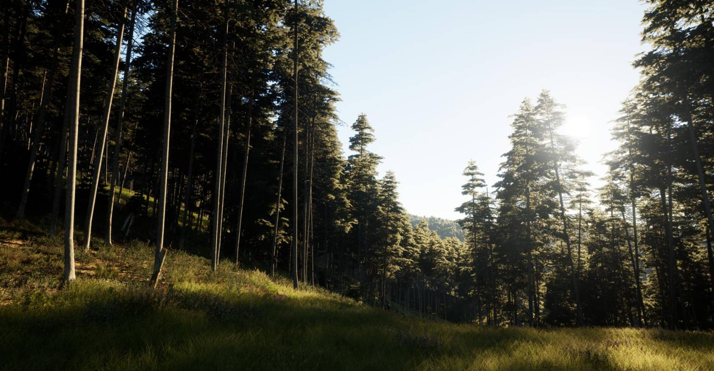

Want to learn more about how Airland World came to life ? Read on ...

<!-- truncate -->

### The Beginnings

Airland World has been in development for almost three years. 

In 2022, Fred, Peter, and Laco met and decided to create a planetary sandbox based on Unreal Engine. 

Peter and Laco are the co-founders of [Outerra](https://www.outerra.com/), the first planetary rendering engine released in 2013, and in 2021 founded [WildRealm](https://wildrealm.ai/) a planetary rendering solution based on Unreal Engine 4 and used for professional simulations.

Fred is a business angel and software developer with experience in e-commerce and video game programming. He is also well-known in the modding community, having created popular mods for _Microsoft Flight Simulator_ and _Arma 3_.

From the beginning, we quickly realized there was no game engine capable of achieving what we envisioned. A planetary-sized playground with AAA rendering capabilities and large-scale multiplayer gameplay simply did not exist. Unreal Engine 5 provided an incredible foundation with unmatched rendering capabilities, but it had its limits for our ambitious goals.

### Overcoming Technical Challenges

First, we wanted the game to feature large-scale multiplayer physics. After evaluating several physics engines, we chose to integrate **Jolt**, an extremely performant and deterministic physics engine capable of handling our requirements.

Next, we faced the challenge of managing thousands of simulated entities. Unreal Engine's Actor and Level system, while powerful, proved too resource-intensive for our needs. To address this, we built our own **Entity and SceneGraph system** based on **ENTT**, an efficient C++ entity-component system. Our system shares similarities with the **Godot node system** but is specifically designed to handle a much larger number of entities. Interestingly, we noticed that Epic Games seems to be exploring a similar path with their newly announced **SceneGraph and Entity System** at Unreal Fest 2024.

### Empowering Creators with LUAU

Ease of modding was another key priority for us. Inspired by platforms like **Roblox** and **FiveM** (the thriving modding ecosystem built around _GTA V_), we aimed to make Airland World accessible to creators of all skill levels. To achieve this, we integrated **LUAU**, a highly performant open-source variant of **LUA** developed by the **Roblox Team** and released in 2021. This scripting layer empowers creators to customize their games and experiences easily, enabling them to focus on creativity rather than technical hurdles.

Our development team, composed of **8 talented developers based in Slovakia** and led by Peter and Laco, worked tirelessly for over 2 years to build these core systems and ensure they worked seamlessly together.

### Building a Thriving Creator Economy

Beyond creation tools, we wanted to provide creators with meaningful opportunities to monetize their work. Inspired by ecosystems like **Roblox Marketplace**, **Microsoft Flight Simulator Marketplace**, and community-driven hubs such as **GTA Mods**, and based on Fred experience in different modding communities, we developed the **Airland Store** and creator economy system.

Fred's team expertise in large-scale web platforms, databases, helped in shaping the Airland Store. Our platform allows both casual and professional creators to immediately benefit from their work. It supports collaboration, team development, and project management, enabling creators to bring their dreams to life while receiving feedback from an engaged player community.

### The Future of Airland World

We see Airland World developing as a platform, a community, and a universe of endless possibilities. With solid financials, a foundation built on cutting-edge technology, a passion for empowering creators, and a vision for a connected, collaborative world, we're excited to see how our players and creators will shape the future of Airland World.

